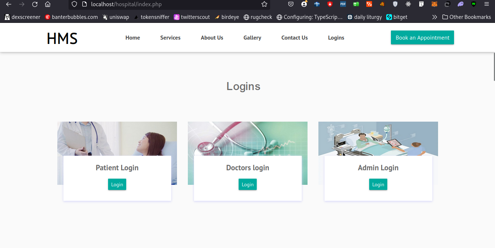
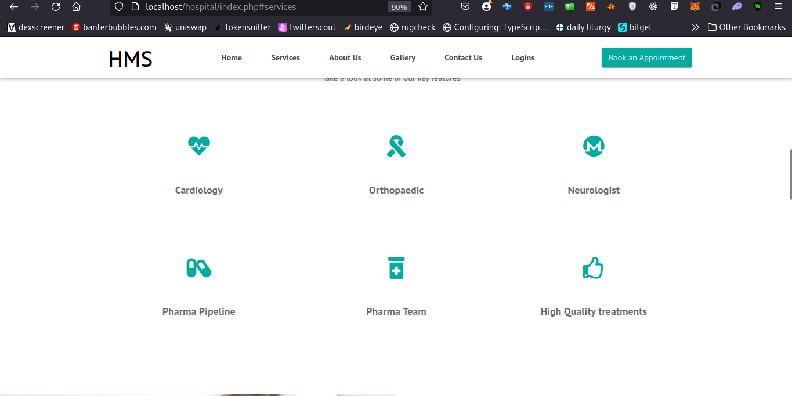

# Hospital Management System

An online hospital management system built using PHP, MySQL, and jQuery.

## Table of Contents
- [Languages Used](#languages-used)
- [Getting Started](#getting-started)
  - [Clone the Repository](#clone-the-repository)
  - [Upload the Project to the Server Root](#upload-the-project-to-the-server-root)
  - [Navigate to the Project Directory](#navigate-to-the-project-directory)
  - [Create a Database](#create-a-database)
  - [Configure Database Connection](#configure-database-connection)
  - [Dependencies](#dependencies)
  - [Start the Development Server](#start-the-development-server)
  - [View the Application](#view-the-application)
  - [Login Details](#login-details)
- [Key Features](#key-features)
  - [Admin Module](#admin-module)
  - [Patient Module](#patient-module)
  - [Doctor Module](#doctor-module)
- [Project Overview](#project-overview)
  - [Screenshots](#screenshots)
    - [Homepage](#homepage)
    - [Our Services](#our-services)
    - [Admin Dashboard](#admin-dashboard)
    - [Doctors Dashboard](#doctors-dashboard)
    - [User/Patient Dashboard](#userpatient-dashboard)
- [Visit My Site](#visit-my-site)

## Languages Used

1. PHP
2. JavaScript

The project is built on `HTML5` and `Bootstrap 4`.

## Getting Started

### Clone the Repository

```bash
git clone https://github.com/patrickkariukikabita/hospitalmanagementsystem.git
```

Alternatively, you can download the code directly from the repository.

### Upload the Project to the Server Root

Upload all project files to the root directory of your web server. For example, on Linux:

```bash
mv hospital /opt/lampp/htdocs/
```

On Windows, move `hospital` to `C:\xampp\htdocs\`.

### Navigate to the Project Directory

```bash
cd hospital
```

### Create a Database

Create a MySQL database named `hms` and upload the `hms.sql` file in the `hms/database/` directory to populate the database. You can use tools like phpMyAdmin or the MySQL command line for this.

### Configure Database Connection

Open the `config.php` file in the `include` directory and update the database connection settings with your database credentials.

```php
define('DB_SERVER','localhost');
define('DB_USER','[your database username]');
define('DB_PASS' ,'[your database password]');
define('DB_NAME', 'hms');
$con = mysqli_connect(DB_SERVER,DB_USER,DB_PASS,DB_NAME);
```

### Dependencies

This project uses the following dependencies:

- jQuery 3.6.3
- Animate.css
- Bootstrap-datepicker
- Chart.js
- CKEditor
- jQuery UI
- Moment.js
- SweetAlert
- Themify Icons
- Twbs-pagination
- Perfect-scrollbar
- Select2

### Start the Development Server

If you're using a local server environment like XAMPP, WAMP, or MAMP, start the server and ensure that Apache and MySQL are running. If you're on a live server, ensure the server is configured to handle PHP and MySQL.

### View the Application

Open your web browser and navigate to `http://localhost/hospital` (for a local server) or your domain name (for a live server) to view and interact with the application.

### Login Details

You can try the project using the following credentials:

- **Admin**: `admin/Test@12345`
- **Patient**: `light@gmail.com/Test@123`
- **Doctor**: `doctor@gmail.com/Test@123`

## Key Features

### Admin Module

The Admin Module provides administrators with a user-friendly dashboard and various functionalities:

- **Patient Management**: Oversee patient information and manage user details efficiently.
- **Doctor Management**: Manage doctor profiles and track appointments.
- **Appointment Tracking**: Monitor appointment schedules and manage user queries.
- **Security Features**: Secure login logs and the ability to update passwords for enhanced security.

### Patient Module

The Patient Module offers patients a user-friendly interface with the following features:

- **Profile Management**: Access and manage personal profiles.
- **Appointment Scheduling**: Book appointments easily and view appointment history.
- **Medical History**: Gain insights into personal medical history.
- **Security Options**: Change passwords and recover lost passwords for a secure user experience.

### Doctor Module

The Doctor Module provides doctors with a comprehensive dashboard for efficient patient management:

- **Profile Access**: Access and manage personal profiles.
- **Appointment Management**: View and track online appointments.
- **Patient Records**: Manage patient records and search for patients by name or mobile number.
- **Security Features**: Enhance password security and recover lost passwords.

## Project Overview

### Screenshots

#### Homepage




#### Our Services



#### Admin Dashboard


#### Doctors Dashboard


#### User/Patient Dashboard


## Visit My Site

- [www.bytemast.com](https://bytemast.com)

Feel free to explore the project, provide feedback or suggestions, and consider giving this project a star if you like it.
